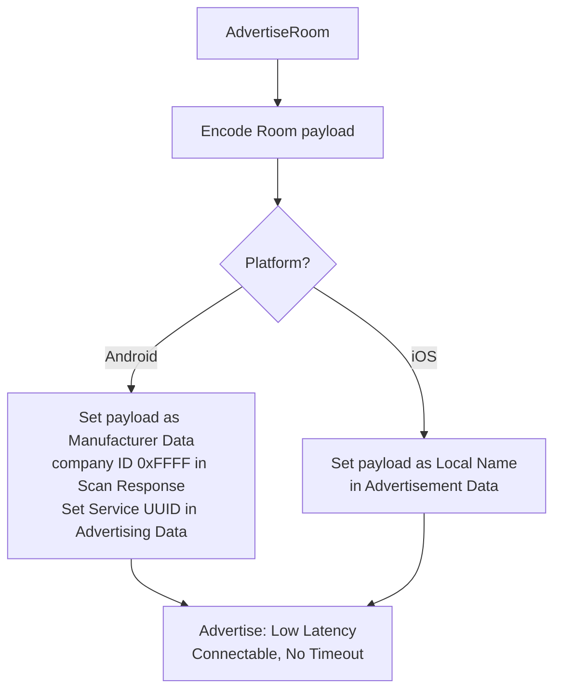
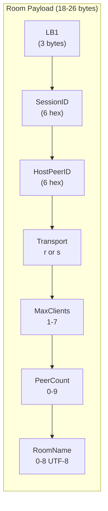
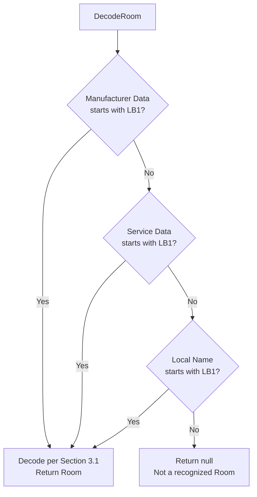
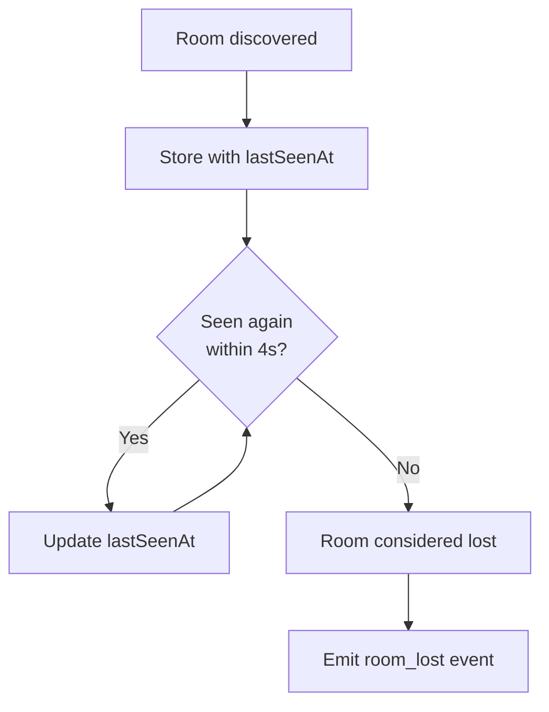

# Room Advertisement & Discovery (Sections 3.1-3.5)

## Advertisement Encoding

```mermaid
flowchart TD
    A[AdvertiseRoom] --> B[Encode Room payload]
    B --> C{Platform?}
    C -->|Android| D[Set payload as Manufacturer Data\ncompany ID 0xFFFF in Scan Response\nSet Service UUID in Advertising Data]
    C -->|iOS| E[Set payload as Local Name\nin Advertisement Data]
    D --> F[Advertise: Low Latency\nConnectable, No Timeout]
    E --> F
```

## Room Payload Structure

```mermaid
flowchart LR
    subgraph "Room Payload (18-26 bytes)"
        A["LB1\n(3 bytes)"] --> B["SessionID\n(6 hex)"]
        B --> C["HostPeerID\n(6 hex)"]
        C --> D["Transport\nr or s"]
        D --> E["MaxClients\n1-7"]
        E --> F["PeerCount\n0-9"]
        F --> G["RoomName\n0-8 UTF-8"]
    end
```

## Discovery Flow

```mermaid
flowchart TD
    A[DecodeRoom] --> B{Manufacturer Data\nstarts with LB1?}
    B -->|Yes| C[Decode per Section 3.1\nReturn Room]
    B -->|No| D{Service Data\nstarts with LB1?}
    D -->|Yes| C
    D -->|No| E{Local Name\nstarts with LB1?}
    E -->|Yes| C
    E -->|No| F[Return null\nNot a recognized Room]
```

## Room Expiry

```mermaid
flowchart TD
    A[Room discovered] --> B[Store with lastSeenAt]
    B --> C{Seen again\nwithin 4s?}
    C -->|Yes| D[Update lastSeenAt]
    D --> C
    C -->|No| E[Room considered lost]
    E --> F[Emit room_lost event]
```
