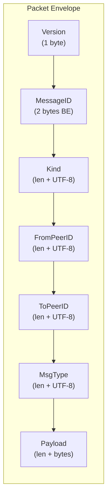
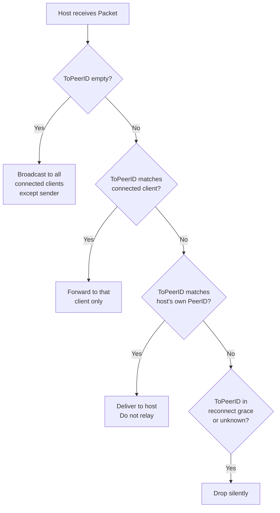
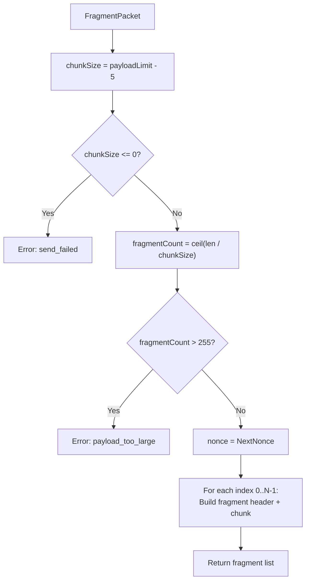
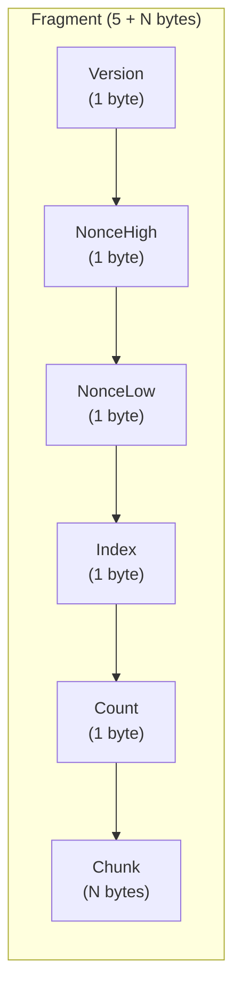
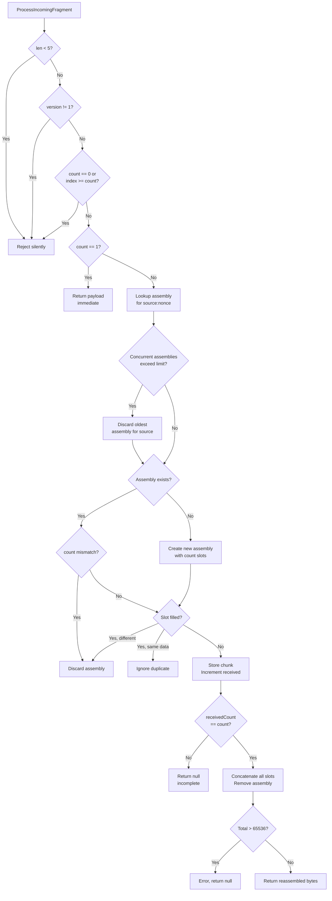

# Packet Format & Routing (Sections 4-5)

## Packet Envelope Structure

```mermaid
flowchart LR
    subgraph "Packet Envelope"
        A["Version\n(1 byte)"] --> B["MessageID\n(2 bytes BE)"]
        B --> C["Kind\n(len + UTF-8)"]
        C --> D["FromPeerID\n(len + UTF-8)"]
        D --> E["ToPeerID\n(len + UTF-8)"]
        E --> F["MsgType\n(len + UTF-8)"]
        F --> G["Payload\n(len + bytes)"]
    end
```

## Message Routing (Host Relay)

```mermaid
flowchart TD
    A[Host receives Packet] --> B{ToPeerID empty?}
    B -->|Yes| C[Broadcast to all\nconnected clients\nexcept sender]
    B -->|No| D{ToPeerID matches\nconnected client?}
    D -->|Yes| E[Forward to that\nclient only]
    D -->|No| F{ToPeerID matches\nhost's own PeerID?}
    F -->|Yes| G[Deliver to host\nDo not relay]
    F -->|No| H{ToPeerID in\nreconnect grace\nor unknown?}
    H -->|Yes| I[Drop silently]
```

## Fragmentation

```mermaid
flowchart TD
    A[FragmentPacket] --> B["chunkSize = payloadLimit - 5"]
    B --> C{chunkSize <= 0?}
    C -->|Yes| D[Error: send_failed]
    C -->|No| E["fragmentCount = ceil(len / chunkSize)"]
    E --> F{fragmentCount > 255?}
    F -->|Yes| G[Error: payload_too_large]
    F -->|No| H[nonce = NextNonce]
    H --> I["For each index 0..N-1:\nBuild fragment header + chunk"]
    I --> J[Return fragment list]
```

## Fragment Header

```mermaid
flowchart LR
    subgraph "Fragment (5 + N bytes)"
        A["Version\n(1 byte)"] --> B["NonceHigh\n(1 byte)"]
        B --> C["NonceLow\n(1 byte)"]
        C --> D["Index\n(1 byte)"]
        D --> E["Count\n(1 byte)"]
        E --> F["Chunk\n(N bytes)"]
    end
```

## Reassembly Flow

```mermaid
flowchart TD
    A[ProcessIncomingFragment] --> B{len < 5?}
    B -->|Yes| Z[Reject silently]
    B -->|No| C{version != 1?}
    C -->|Yes| Z
    C -->|No| D{count == 0 or\nindex >= count?}
    D -->|Yes| Z
    D -->|No| E{count == 1?}
    E -->|Yes| F[Return payload\nimmediate]
    E -->|No| G[Lookup assembly\nfor source:nonce]
    G --> H{Concurrent assemblies\nexceed limit?}
    H -->|Yes| I[Discard oldest\nassembly for source]
    I --> J
    H -->|No| J{Assembly exists?}
    J -->|No| K[Create new assembly\nwith count slots]
    J -->|Yes| L{count mismatch?}
    L -->|Yes| M[Discard assembly]
    L -->|No| N{Slot filled?}
    K --> N
    N -->|Yes, same data| O[Ignore duplicate]
    N -->|Yes, different| M
    N -->|No| P[Store chunk\nIncrement received]
    P --> Q{receivedCount\n== count?}
    Q -->|No| R[Return null\nincomplete]
    Q -->|Yes| S[Concatenate all slots\nRemove assembly]
    S --> T{Total > 65536?}
    T -->|Yes| U[Error, return null]
    T -->|No| V[Return reassembled bytes]
```
