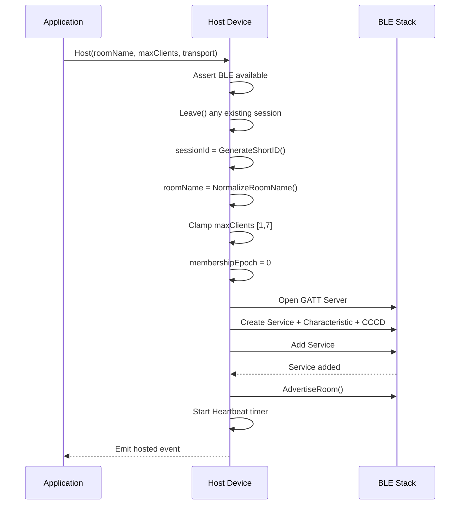
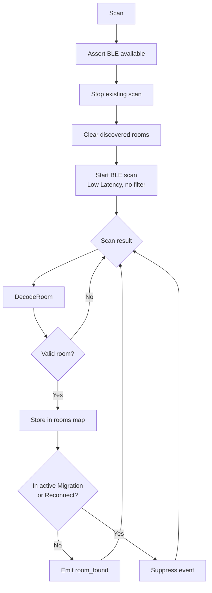
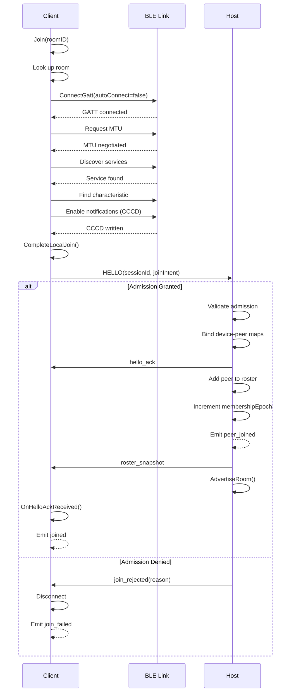
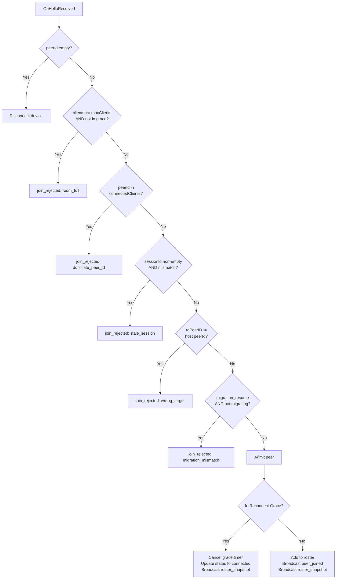
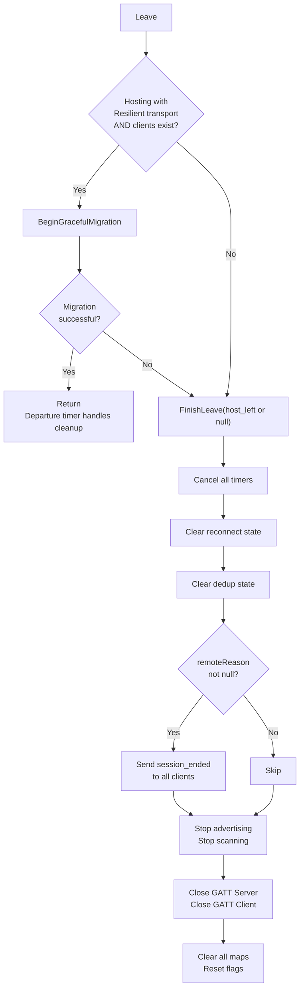

# Connection Lifecycle (Section 6)

## Hosting a Session (Section 6.1)

## Scanning for Rooms (Section 6.2)

## Join Handshake (Sections 6.3-6.5)

## HELLO Validation (Section 6.5)

## Leaving a Session (Section 6.6)

