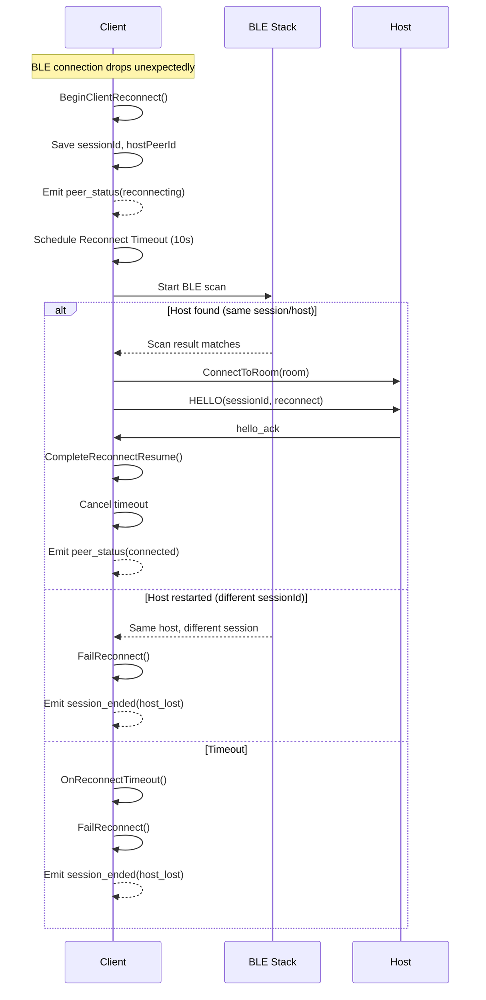
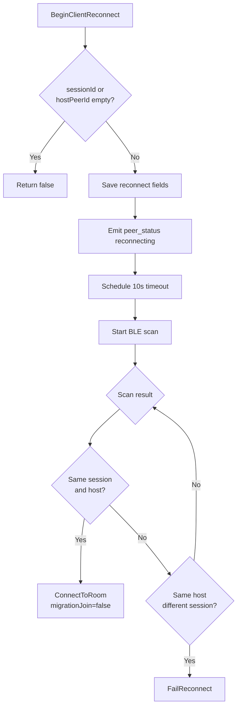
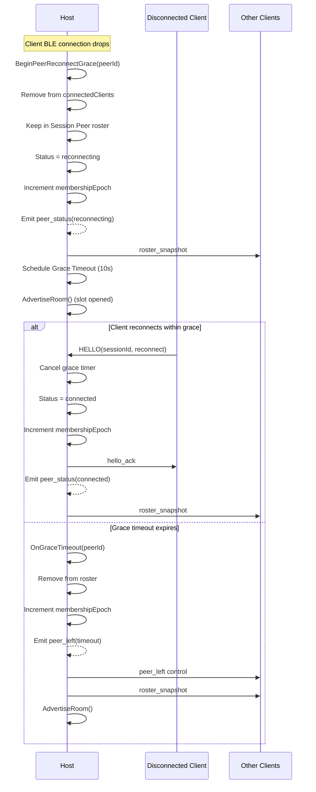
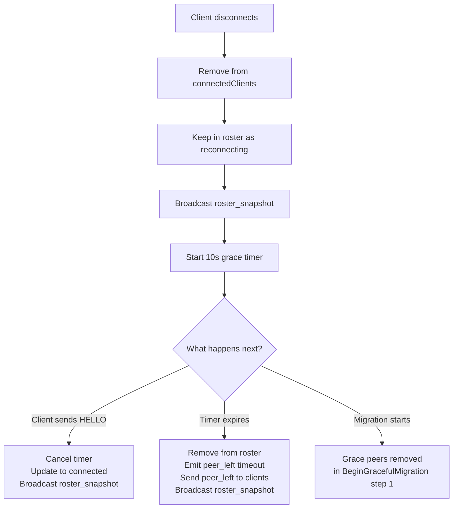

# Reconnection (Section 7)

## Client Reconnect Flow (Section 7.1)

```mermaid
sequenceDiagram
    participant Client as Client
    participant BLE as BLE Stack
    participant Host as Host

    Note over Client: BLE connection drops unexpectedly
    Client->>Client: BeginClientReconnect()
    Client->>Client: Save sessionId, hostPeerId
    Client-->>Client: Emit peer_status(reconnecting)
    Client->>Client: Schedule Reconnect Timeout (10s)
    Client->>BLE: Start BLE scan

    alt Host found (same session/host)
        BLE-->>Client: Scan result matches
        Client->>Host: ConnectToRoom(room)
        Client->>Host: HELLO(sessionId, reconnect)
        Host->>Client: hello_ack
        Client->>Client: CompleteReconnectResume()
        Client->>Client: Cancel timeout
        Client-->>Client: Emit peer_status(connected)
    else Host restarted (different sessionId)
        BLE-->>Client: Same host, different session
        Client->>Client: FailReconnect()
        Client-->>Client: Emit session_ended(host_lost)
    else Timeout
        Client->>Client: OnReconnectTimeout()
        Client->>Client: FailReconnect()
        Client-->>Client: Emit session_ended(host_lost)
    end
```

## Client Reconnect Decision Flow

```mermaid
flowchart TD
    A[BeginClientReconnect] --> B{sessionId or\nhostPeerId empty?}
    B -->|Yes| C[Return false]
    B -->|No| D[Save reconnect fields]
    D --> E[Emit peer_status reconnecting]
    E --> F[Schedule 10s timeout]
    F --> G[Start BLE scan]
    G --> H{Scan result}
    H --> I{Same session\nand host?}
    I -->|Yes| J[ConnectToRoom\nmigrationJoin=false]
    I -->|No| K{Same host\ndifferent session?}
    K -->|Yes| L[FailReconnect]
    K -->|No| H
```

## Host Reconnect Grace (Section 7.2)

```mermaid
sequenceDiagram
    participant Host as Host
    participant Client1 as Disconnected Client
    participant Others as Other Clients

    Note over Host: Client BLE connection drops
    Host->>Host: BeginPeerReconnectGrace(peerId)
    Host->>Host: Remove from connectedClients
    Host->>Host: Keep in Session Peer roster
    Host->>Host: Status = reconnecting
    Host->>Host: Increment membershipEpoch
    Host-->>Host: Emit peer_status(reconnecting)
    Host->>Others: roster_snapshot
    Host->>Host: Schedule Grace Timeout (10s)
    Host->>Host: AdvertiseRoom() (slot opened)

    alt Client reconnects within grace
        Client1->>Host: HELLO(sessionId, reconnect)
        Host->>Host: Cancel grace timer
        Host->>Host: Status = connected
        Host->>Host: Increment membershipEpoch
        Host->>Client1: hello_ack
        Host-->>Host: Emit peer_status(connected)
        Host->>Others: roster_snapshot
    else Grace timeout expires
        Host->>Host: OnGraceTimeout(peerId)
        Host->>Host: Remove from roster
        Host->>Host: Increment membershipEpoch
        Host-->>Host: Emit peer_left(timeout)
        Host->>Others: peer_left control
        Host->>Others: roster_snapshot
        Host->>Host: AdvertiseRoom()
    end
```

## Grace Timer Lifecycle

```mermaid
flowchart TD
    A[Client disconnects] --> B[Remove from connectedClients]
    B --> C[Keep in roster as reconnecting]
    C --> D[Broadcast roster_snapshot]
    D --> E[Start 10s grace timer]
    E --> F{What happens next?}
    F -->|Client sends HELLO| G[Cancel timer\nUpdate to connected\nBroadcast roster_snapshot]
    F -->|Timer expires| H[Remove from roster\nEmit peer_left timeout\nSend peer_left to clients\nBroadcast roster_snapshot]
    F -->|Migration starts| I[Grace peers removed\nin BeginGracefulMigration step 1]
```
