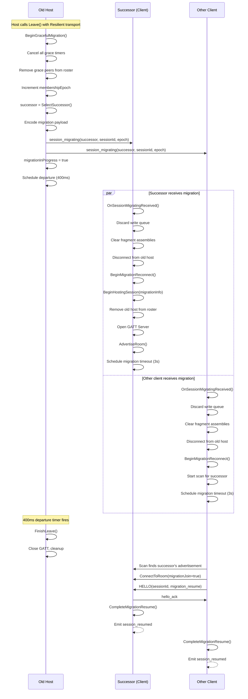
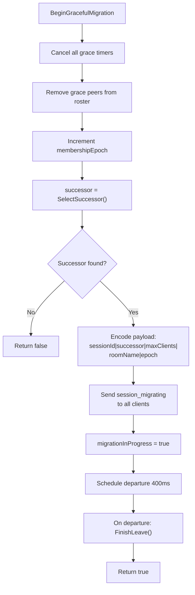
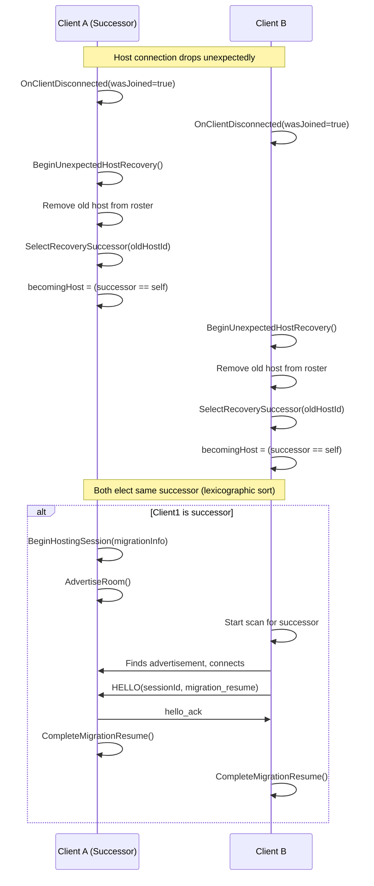
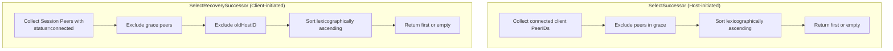
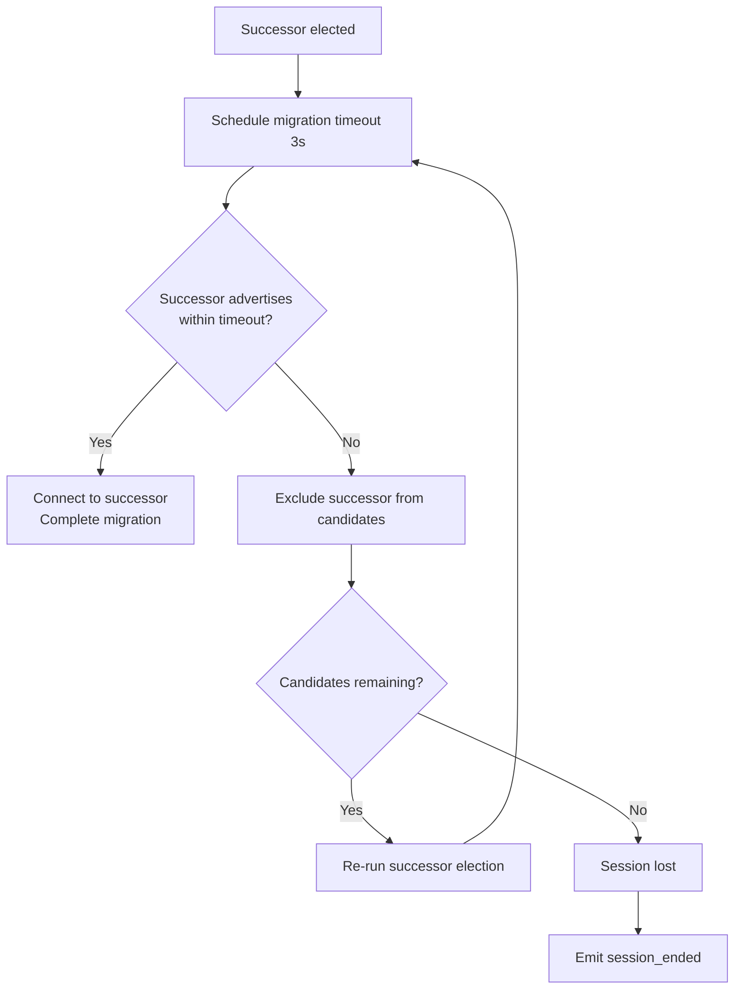
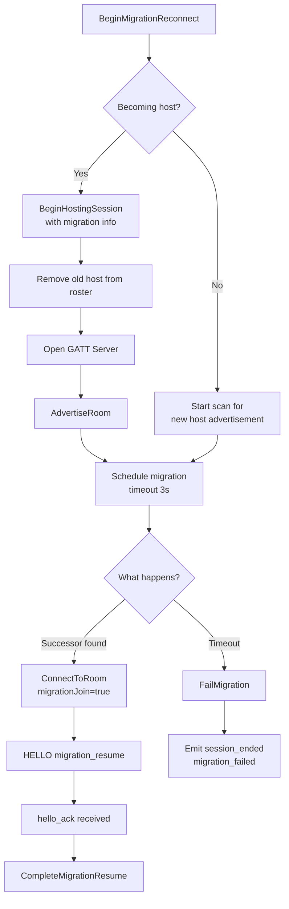
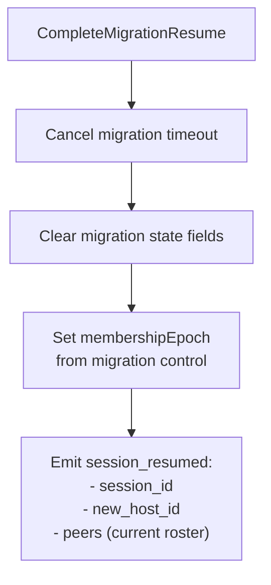

# Migration (Section 8)

## Graceful Migration - Full Sequence (Section 8.1)

## BeginGracefulMigration Flow (Section 8.1)

## Unexpected Host Recovery (Section 8.2)

## Successor Selection (Section 8.3)

## Convergence Fallback (Section 8.3)

## Migration Reconnect (Section 8.4)

## CompleteMigrationResume (Section 8.5)

