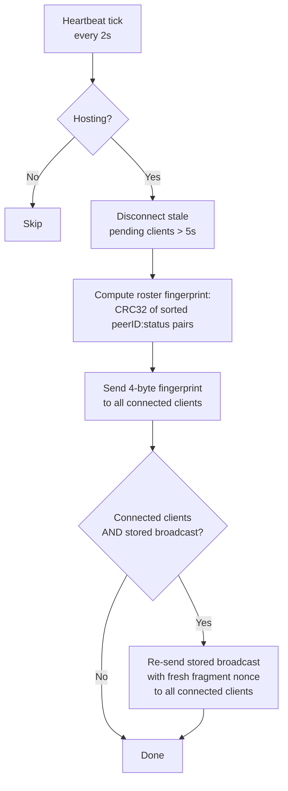
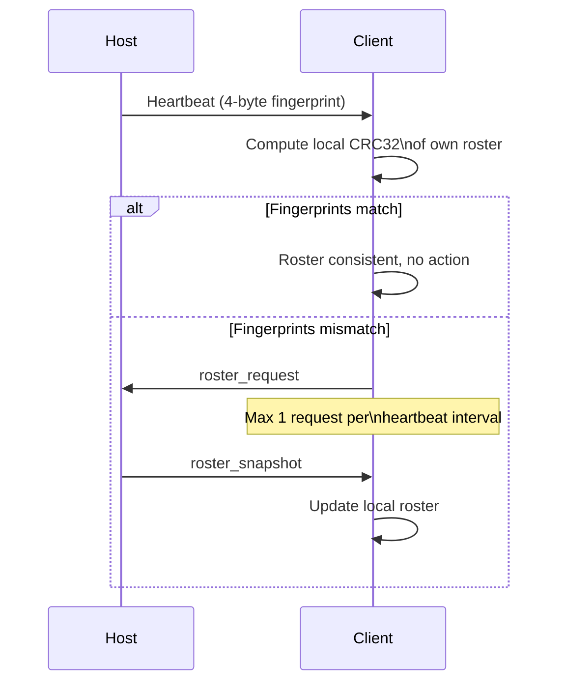
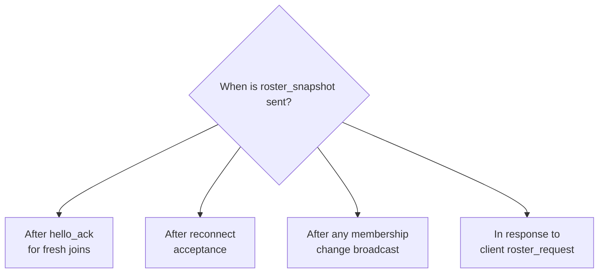

# Heartbeat & Roster Consistency (Section 9)

## Heartbeat Tick

```mermaid
flowchart TD
    A[Heartbeat tick\nevery 2s] --> B{Hosting?}
    B -->|No| Z[Skip]
    B -->|Yes| C[Disconnect stale\npending clients > 5s]
    C --> D["Compute roster fingerprint:\nCRC32 of sorted peerID:status pairs"]
    D --> E[Send 4-byte fingerprint\nto all connected clients]
    E --> F{Connected clients\nAND stored broadcast?}
    F -->|No| G[Done]
    F -->|Yes| H[Re-send stored broadcast\nwith fresh fragment nonce\nto all connected clients]
    H --> G
```

## Roster Fingerprint Validation

```mermaid
sequenceDiagram
    participant Host as Host
    participant Client as Client

    Host->>Client: Heartbeat (4-byte fingerprint)
    Client->>Client: Compute local CRC32\nof own roster

    alt Fingerprints match
        Client->>Client: Roster consistent, no action
    else Fingerprints mismatch
        Client->>Host: roster_request
        Note over Client: Max 1 request per\nheartbeat interval
        Host->>Client: roster_snapshot
        Client->>Client: Update local roster
    end
```

## Roster Snapshot Delivery Rules

```mermaid
flowchart TD
    A{When is roster_snapshot sent?}
    A --> B[After hello_ack\nfor fresh joins]
    A --> C[After reconnect\nacceptance]
    A --> D[After any membership\nchange broadcast]
    A --> E[In response to\nclient roster_request]
```
