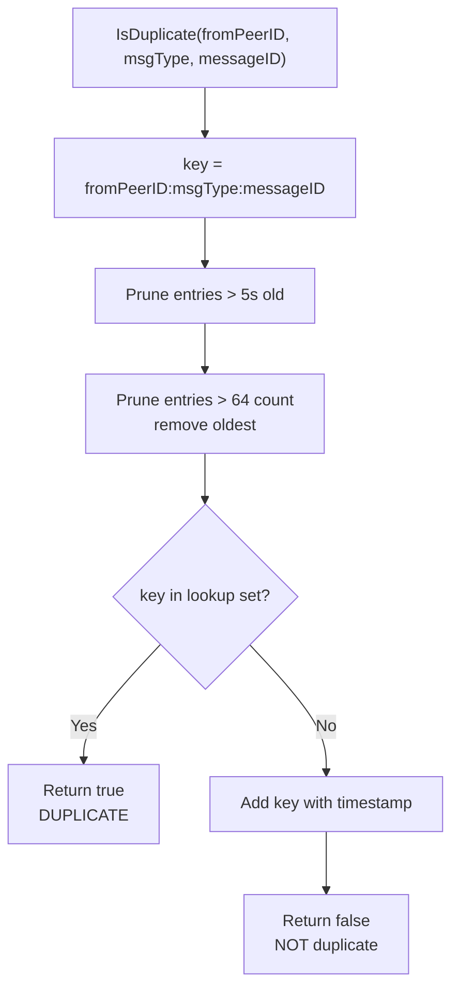
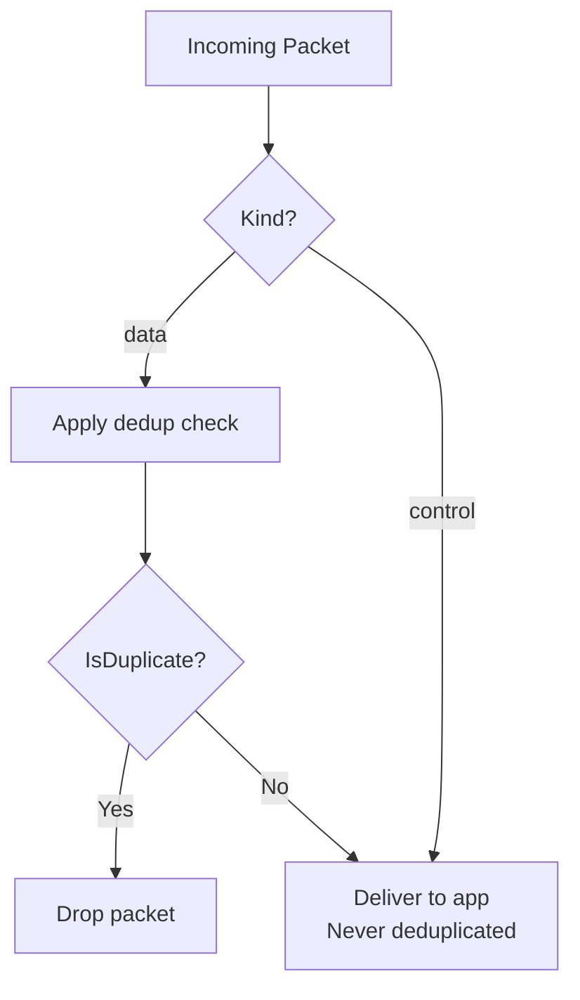

# Deduplication (Section 10)

## Dedup Decision Flow

```mermaid
flowchart TD
    A["IsDuplicate(fromPeerID, msgType, messageID)"] --> B["key = fromPeerID:msgType:messageID"]
    B --> C[Prune entries > 5s old]
    C --> D[Prune entries > 64 count\nremove oldest]
    D --> E{key in lookup set?}
    E -->|Yes| F[Return true\nDUPLICATE]
    E -->|No| G[Add key with timestamp]
    G --> H[Return false\nNOT duplicate]
```

## Dedup Scope

```mermaid
flowchart TD
    A[Incoming Packet] --> B{Kind?}
    B -->|data| C[Apply dedup check]
    C --> D{IsDuplicate?}
    D -->|Yes| E[Drop packet]
    D -->|No| F[Deliver to app]
    B -->|control| F[Deliver to app\nNever deduplicated]
```
