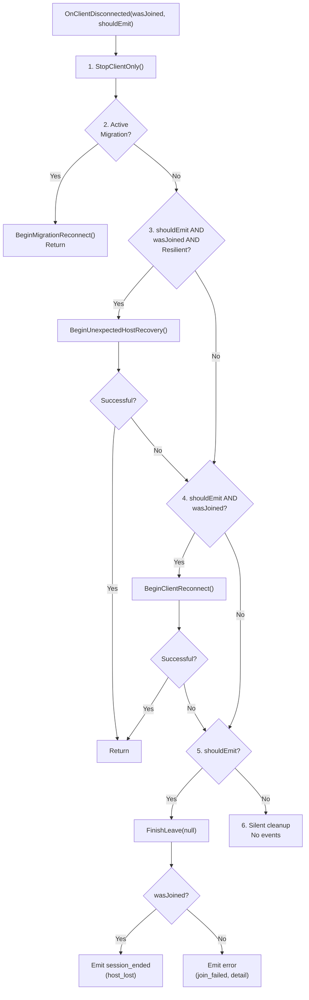
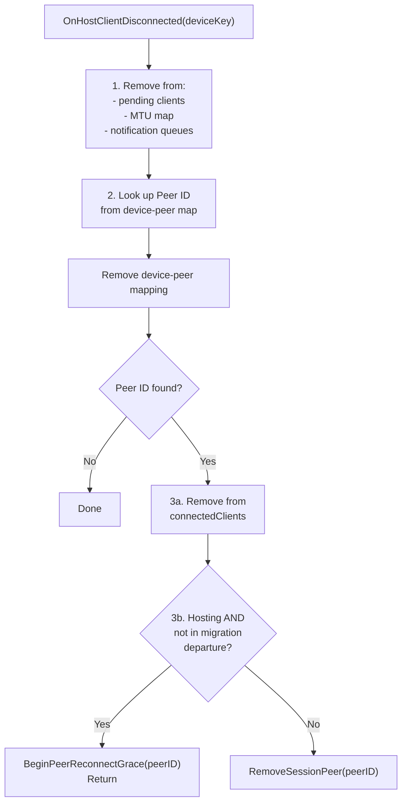
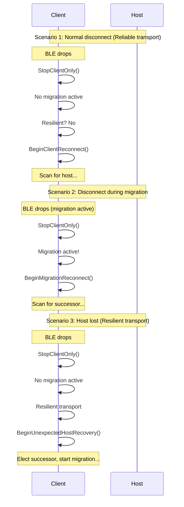

# Disconnect Decision Trees (Sections 13-14)

## Client Disconnect Decision Tree (Section 13)

```mermaid
flowchart TD
    A["OnClientDisconnected(wasJoined, shouldEmit)"] --> B["1. StopClientOnly()"]
    B --> C{"2. Active\nMigration?"}
    C -->|Yes| D["BeginMigrationReconnect()\nReturn"]
    C -->|No| E{"3. shouldEmit AND\nwasJoined AND\nResilient?"}
    E -->|Yes| F["BeginUnexpectedHostRecovery()"]
    F --> G{Successful?}
    G -->|Yes| H[Return]
    G -->|No| I
    E -->|No| I{"4. shouldEmit AND\nwasJoined?"}
    I -->|Yes| J["BeginClientReconnect()"]
    J --> K{Successful?}
    K -->|Yes| H
    K -->|No| L
    I -->|No| L{"5. shouldEmit?"}
    L -->|Yes| M["FinishLeave(null)"]
    M --> N{wasJoined?}
    N -->|Yes| O["Emit session_ended\n(host_lost)"]
    N -->|No| P["Emit error\n(join_failed, detail)"]
    L -->|No| Q["6. Silent cleanup\nNo events"]
```

## Host Client-Disconnect Decision Tree (Section 14)

```mermaid
flowchart TD
    A["OnHostClientDisconnected(deviceKey)"] --> B["1. Remove from:\n- pending clients\n- MTU map\n- notification queues"]
    B --> C["2. Look up Peer ID\nfrom device-peer map"]
    C --> D[Remove device-peer mapping]
    D --> E{Peer ID found?}
    E -->|No| F[Done]
    E -->|Yes| G["3a. Remove from\nconnectedClients"]
    G --> H{"3b. Hosting AND\nnot in migration\ndeparture?"}
    H -->|Yes| I["BeginPeerReconnectGrace(peerID)\nReturn"]
    H -->|No| J["RemoveSessionPeer(peerID)"]
```

## Combined Disconnect Scenarios

```mermaid
sequenceDiagram
    participant Client as Client
    participant Host as Host

    Note over Client,Host: Scenario 1: Normal disconnect (Reliable transport)
    Note over Client: BLE drops
    Client->>Client: StopClientOnly()
    Client->>Client: No migration active
    Client->>Client: Resilient? No
    Client->>Client: BeginClientReconnect()
    Note over Client: Scan for host...

    Note over Client,Host: Scenario 2: Disconnect during migration
    Note over Client: BLE drops (migration active)
    Client->>Client: StopClientOnly()
    Client->>Client: Migration active!
    Client->>Client: BeginMigrationReconnect()
    Note over Client: Scan for successor...

    Note over Client,Host: Scenario 3: Host lost (Resilient transport)
    Note over Client: BLE drops
    Client->>Client: StopClientOnly()
    Client->>Client: No migration active
    Client->>Client: Resilient transport
    Client->>Client: BeginUnexpectedHostRecovery()
    Note over Client: Elect successor, start migration...
```
