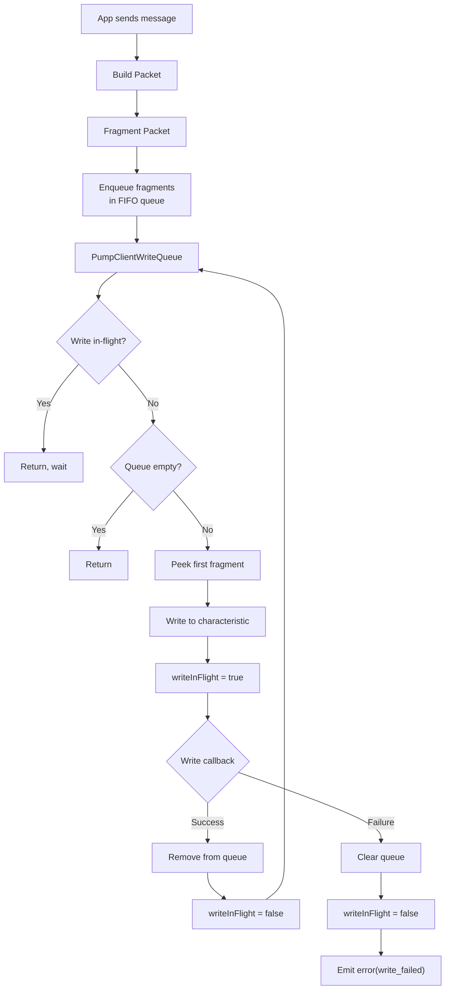
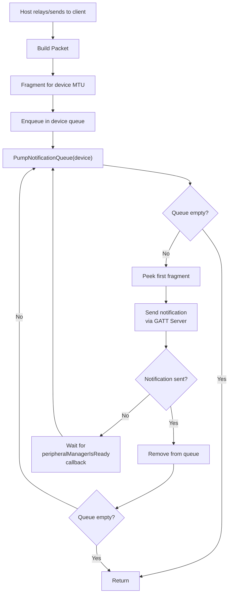
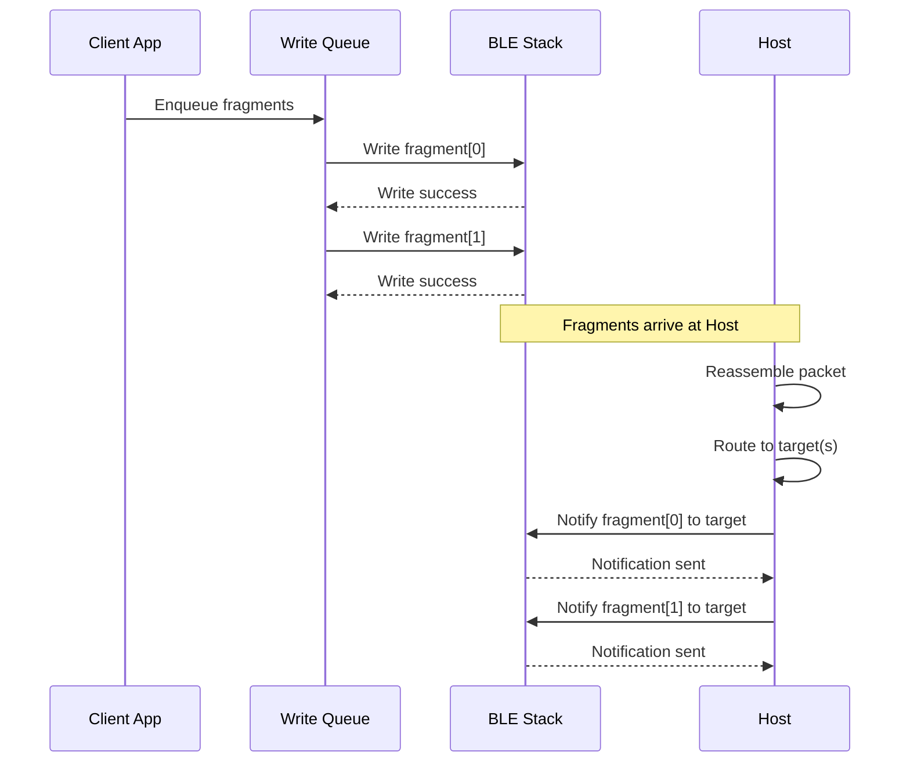

# Write Serialization (Section 15)

## Client Write Queue (Section 15.1)

```mermaid
flowchart TD
    A[App sends message] --> B[Build Packet]
    B --> C[Fragment Packet]
    C --> D[Enqueue fragments\nin FIFO queue]
    D --> E[PumpClientWriteQueue]
    E --> F{Write in-flight?}
    F -->|Yes| G[Return, wait]
    F -->|No| H{Queue empty?}
    H -->|Yes| I[Return]
    H -->|No| J[Peek first fragment]
    J --> K[Write to characteristic]
    K --> L[writeInFlight = true]
    L --> M{Write callback}
    M -->|Success| N[Remove from queue]
    N --> O[writeInFlight = false]
    O --> E
    M -->|Failure| P[Clear queue]
    P --> Q[writeInFlight = false]
    Q --> R["Emit error(write_failed)"]
```

## Host Notification Queue (Section 15.2)

```mermaid
flowchart TD
    A[Host relays/sends to client] --> B[Build Packet]
    B --> C[Fragment for device MTU]
    C --> D[Enqueue in device queue]
    D --> E["PumpNotificationQueue(device)"]
    E --> F{Queue empty?}
    F -->|Yes| G[Return]
    F -->|No| H[Peek first fragment]
    H --> I[Send notification\nvia GATT Server]
    I --> J{Notification sent?}
    J -->|Yes| K[Remove from queue]
    K --> L{Queue empty?}
    L -->|No| E
    L -->|Yes| G
    J -->|No| M["Wait for\nperipheralManagerIsReady\ncallback"]
    M --> E
```

## Write Flow - Full Path

```mermaid
sequenceDiagram
    participant App as Client App
    participant Queue as Write Queue
    participant BLE as BLE Stack
    participant Host as Host

    App->>Queue: Enqueue fragments
    Queue->>BLE: Write fragment[0]
    BLE-->>Queue: Write success
    Queue->>BLE: Write fragment[1]
    BLE-->>Queue: Write success
    Note over BLE,Host: Fragments arrive at Host
    Host->>Host: Reassemble packet
    Host->>Host: Route to target(s)
    Host->>BLE: Notify fragment[0] to target
    BLE-->>Host: Notification sent
    Host->>BLE: Notify fragment[1] to target
    BLE-->>Host: Notification sent
```
