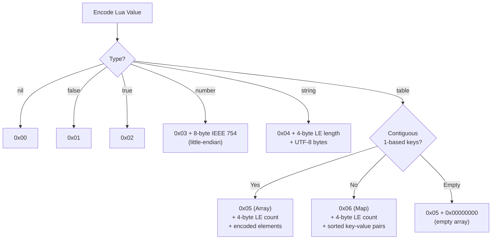
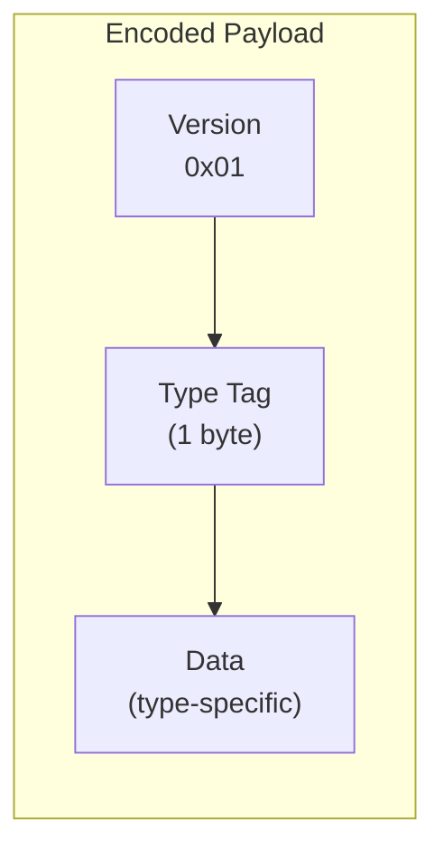
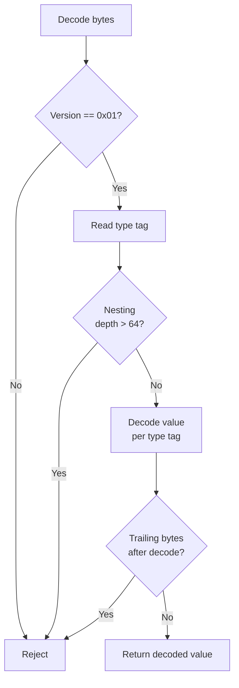

# Codec - Payload Serialization (Section 11)

## Encoding Decision Tree

```mermaid
flowchart TD
    A[Encode Lua Value] --> B{Type?}
    B -->|nil| C["0x00"]
    B -->|false| D["0x01"]
    B -->|true| E["0x02"]
    B -->|number| F["0x03 + 8-byte IEEE 754\n(little-endian)"]
    B -->|string| G["0x04 + 4-byte LE length\n+ UTF-8 bytes"]
    B -->|table| H{Contiguous\n1-based keys?}
    H -->|Yes| I["0x05 (Array)\n+ 4-byte LE count\n+ encoded elements"]
    H -->|No| J["0x06 (Map)\n+ 4-byte LE count\n+ sorted key-value pairs"]
    H -->|Empty| K["0x05 + 0x00000000\n(empty array)"]
```

## Codec Wire Format

```mermaid
flowchart LR
    subgraph "Encoded Payload"
        V["Version\n0x01"] --> T["Type Tag\n(1 byte)"]
        T --> D["Data\n(type-specific)"]
    end
```

## Decoding Flow

```mermaid
flowchart TD
    A[Decode bytes] --> B{Version == 0x01?}
    B -->|No| C[Reject]
    B -->|Yes| D[Read type tag]
    D --> E{Nesting\ndepth > 64?}
    E -->|Yes| C
    E -->|No| F[Decode value\nper type tag]
    F --> G{Trailing bytes\nafter decode?}
    G -->|Yes| C
    G -->|No| H[Return decoded value]
```
