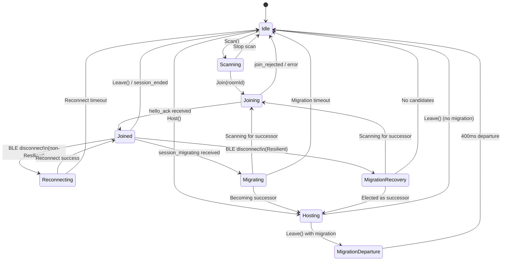
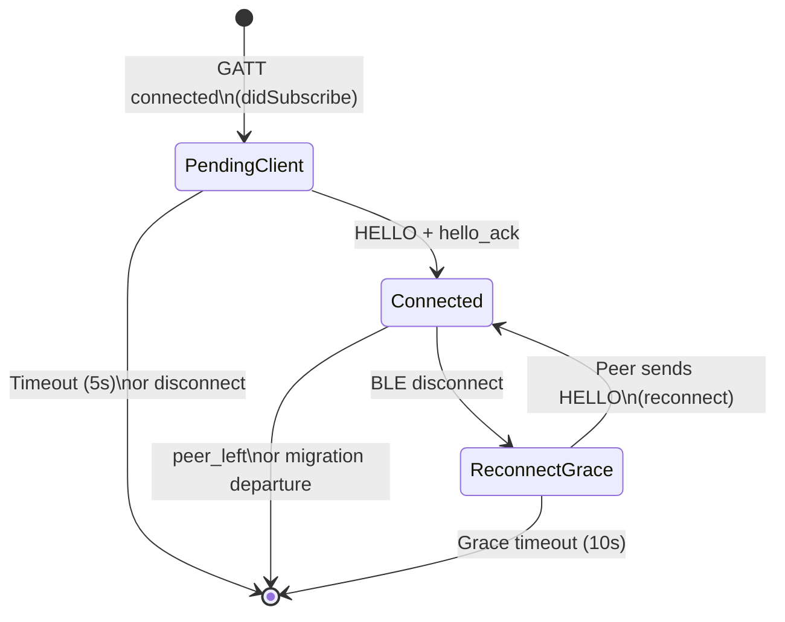
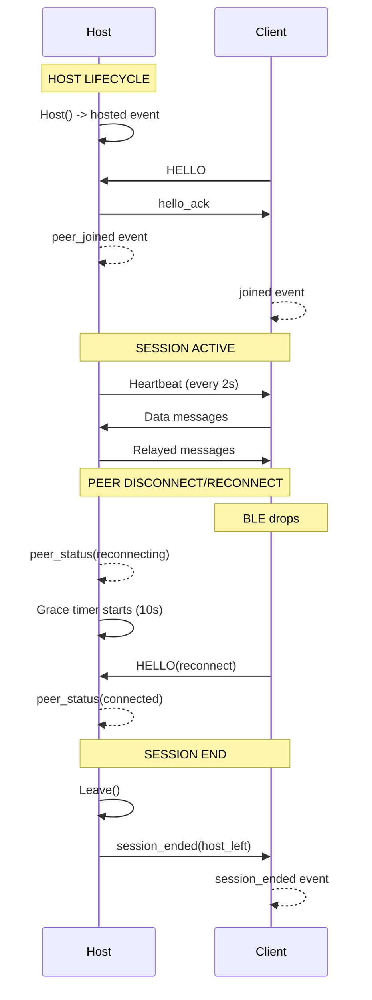
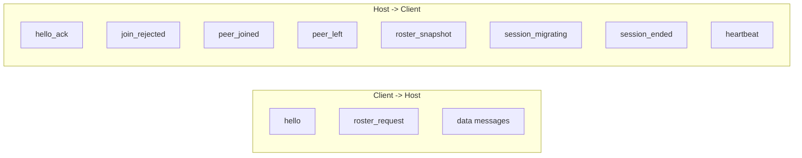

# Session State Machine (Overview)

## Peer Lifecycle States

```mermaid
stateDiagram-v2
    [*] --> Idle
    Idle --> Scanning: Scan()
    Idle --> Hosting: Host()
    Scanning --> Idle: Stop scan
    Scanning --> Joining: Join(roomId)
    Joining --> Joined: hello_ack received
    Joining --> Idle: join_rejected / error
    Joined --> Reconnecting: BLE disconnect\n(non-Resilient)
    Joined --> MigrationRecovery: BLE disconnect\n(Resilient)
    Joined --> Migrating: session_migrating received
    Joined --> Idle: Leave() / session_ended
    Reconnecting --> Joined: Reconnect success
    Reconnecting --> Idle: Reconnect timeout
    Migrating --> Hosting: Becoming successor
    Migrating --> Joining: Scanning for successor
    Migrating --> Idle: Migration timeout
    MigrationRecovery --> Hosting: Elected as successor
    MigrationRecovery --> Joining: Scanning for successor
    MigrationRecovery --> Idle: No candidates
    Hosting --> Idle: Leave() (no migration)
    Hosting --> MigrationDeparture: Leave() with migration
    MigrationDeparture --> Idle: 400ms departure
```

## Host-Side Peer States

```mermaid
stateDiagram-v2
    [*] --> PendingClient: GATT connected\n(didSubscribe)
    PendingClient --> Connected: HELLO + hello_ack
    PendingClient --> [*]: Timeout (5s)\nor disconnect
    Connected --> ReconnectGrace: BLE disconnect
    Connected --> [*]: peer_left\nor migration departure
    ReconnectGrace --> Connected: Peer sends HELLO\n(reconnect)
    ReconnectGrace --> [*]: Grace timeout (10s)
```

## Session Event Flow

```mermaid
sequenceDiagram
    participant Host as Host
    participant Client as Client

    Note over Host: HOST LIFECYCLE
    Host->>Host: Host() -> hosted event
    Client->>Host: HELLO
    Host->>Client: hello_ack
    Host-->>Host: peer_joined event
    Client-->>Client: joined event

    Note over Host,Client: SESSION ACTIVE
    Host->>Client: Heartbeat (every 2s)
    Client->>Host: Data messages
    Host->>Client: Relayed messages

    Note over Host,Client: PEER DISCONNECT/RECONNECT
    Note over Client: BLE drops
    Host-->>Host: peer_status(reconnecting)
    Host->>Host: Grace timer starts (10s)
    Client->>Host: HELLO(reconnect)
    Host-->>Host: peer_status(connected)

    Note over Host,Client: SESSION END
    Host->>Host: Leave()
    Host->>Client: session_ended(host_left)
    Client-->>Client: session_ended event
```

## Control Message Flow Summary

```mermaid
flowchart LR
    subgraph "Client -> Host"
        A[hello]
        B[roster_request]
        C[data messages]
    end

    subgraph "Host -> Client"
        D[hello_ack]
        E[join_rejected]
        F[peer_joined]
        G[peer_left]
        H[roster_snapshot]
        I[session_migrating]
        J[session_ended]
        K[heartbeat]
    end
```
